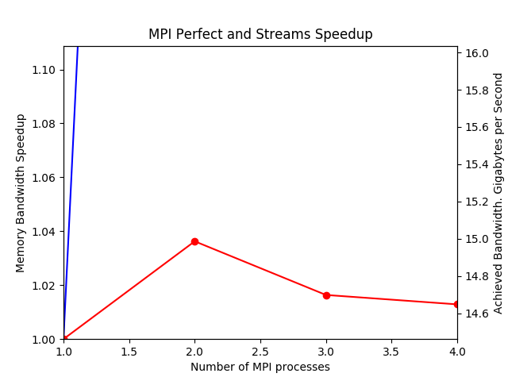

##############################################
Finite Element Analysis Multiprocessing System
##############################################

.. |copy| unicode:: U+000A9 .. COPYRIGHT SIGN

Copyright |copy| 2017 by `Professor Torsten Calvi Corporation <http://torstencalvi.com/>`_. All rights reserved.

This investigation into finite element analysis via multiprocessing is being done under contract for `Professor Torsten Calvi Corporation <http://torstencalvi.com/>`_. The company has graciously allowed public access to documentation regarding this project.

A minimal Ubuntu 16.04 installation is required.

***********************************
Autodesk Inventor Professional 2017
***********************************

Inventor's stress analysis only supports solving linear, static problems. See `stress analysis assumptions <https://knowledge.autodesk.com/support/inventor-products/troubleshooting/caas/sfdcarticles/sfdcarticles/Stress-analysis-assumptions.html>`_.

***************
Ansys AIM R17.0
***************

It seems to be able to do the job. The ability to use it with supercomputing clusters was not investigated.

*****************************
SOLIDWORKS Simulation Premium
*****************************

SOLIDWORKS Simulation Premium seems to have the right set of `features <http://www.solidworks.com/sw/products/simulation/matrix.htm>`_ required. No tests were done.

***********
Salome-Meca
***********

| Version: 2016.1
| Source: http://www.code-aster.org/FICHIERS/SALOME-MECA-2016-LGPL-1.tgz

Packaged Code_Aster is not compiled with MPI support.

Gmsh
====

Dependencies::

    libatlas3-base

Link the following libraries::

    ln -s /usr/lib/atlas-base/atlas/liblapack.so.3 /usr/lib/liblapack.so.3gf
    ln -s /usr/lib/atlas-base/libf77blas.so.3 /usr/lib/libf77blas.so.3gf
    ln -s /usr/lib/atlas-base/libcblas.so.3 /usr/lib/libcblas.so.3gf
    ln -s /usr/lib/atlas-base/libatlas.so.3 /usr/lib/libatlas.so.3gf

Run Salome: ``LD_PRELOAD="/usr/lib/x86_64-linux-gnu/libgfortran.so.3" ./salome``

************************************
Attempt #2: Code_Aster 12.7 (stable)
************************************

Environment::

    export PREFIX="/usr/local"

Required Ubuntu packages::

    build-essential
    cmake
    flex
    bison
    libtool
    gfortran
..    mpi-default-bin
..    mpi-default-dev
..    lam4-dev
    libz-dev
    libatlas-base-dev
..    libscalapack-mpi-dev

Optional Ubuntu packages::

    python-qt4  # For eficasQt

Required Python packages::

    setuptools
    pip
    matplotlib

.. note::
   Install the Python packages from `PyPI <https://pypi.python.org/>`_. Extract both ``setuptools`` and ``pip`` and then set ``PYTHONPATH`` to the extracted ``pip`` directory when executing ``bootstrap.py`` for ``setuptools``.

The following parameters should be used to configure all software::

    --prefix="${PREFIX}"

..
    OpenBLAS
    ========

    | Version: 0.2.19
    | Source: http://github.com/xianyi/OpenBLAS/archive/v0.2.19.tar.gz

    We assume that your ``TARGET`` is an Intel Haswell processor. If not, see `TargetList.txt <https://github.com/xianyi/OpenBLAS/blob/develop/TargetList.txt>`_ for other valid targets.

    According to an `R benchmark <http://blog.nguyenvq.com/blog/2014/11/10/optimized-r-and-python-standard-blas-vs-atlas-vs-openblas-vs-mkl/>`_, `OpenBLAS <https://www.openblas.net/>`_ is significantly faster than `Netlib BLAS <http://www.netlib.org/blas/>`_. The `Intel MKL <https://software.intel.com/en-us/intel-mkl>`_ is supposedly the fastest out of all of them.

    The following variables should be set::

        USE_OPENMP=1
        OMP_NUM_THREADS=4 # Not sure if this is used during compile-time or run-time
        TARGET="HASWELL"

    ``TARGET="HASWELL" make -j4 && make PREFIX=${PREFIX} install``

OpenMPI
=======

| Version: 2.0.2
| Source: https://www.open-mpi.org/software/ompi/v2.0/downloads/openmpi-2.0.2.tar.bz2

`Code_Aster (Parallel)`_ requires a statically linked OpenMPI install. Build OpenMPI with the following::

    ./configure --prefix="${PREFIX}" --disable-dlopen --enable-static --without-memory-manager
    make -j4
    make install

OpenBLAS
========

| Version: 0.2.19
| Source: http://github.com/xianyi/OpenBLAS/archive/v0.2.19.tar.gz

We assume that your ``TARGET`` is an Intel Haswell processor. If not, see `TargetList.txt <https://github.com/xianyi/OpenBLAS/blob/develop/TargetList.txt>`_ for other valid targets.

According to an `R benchmark <http://blog.nguyenvq.com/blog/2014/11/10/optimized-r-and-python-standard-blas-vs-atlas-vs-openblas-vs-mkl/>`_, `OpenBLAS <https://www.openblas.net/>`_ is significantly faster than `Netlib BLAS <http://www.netlib.org/blas/>`_. The `Intel MKL <https://software.intel.com/en-us/intel-mkl>`_ is supposedly the fastest out of all of them.

``CC="mpicc" CXX="mpiCC" FC="mpif90" TARGET="HASWELL" USE_OPENMP=1 NO_AFFINITY=1 make -j4 && make install``

ScaLAPACK
=========

| Version: 2.0.2
| Installer: http://www.netlib.org/scalapack/scalapack_installer.tgz

The ScaLAPACK installer was tested with the following parameters:

``python setup.py --prefix="${PREFIX}" --mpicc="mpicc" --mpif90="mpif90" --mpiincdir="${PREFIX}/include" --lapacklib="${PREFIX}/lib/libopenblas.a" --ldflags_c="-fopenmp" --ldflags_fc="-fopenmp" --notesting``

Code_Aster (Sequential)
=======================

This is required to install pre-requisites for parallel computation.

Edit ``products.py`` and do the following:

* Add ``--enable-shared`` to ``configure`` of ``setup_hdf5()`` to force the building of shared libraries which ``MED`` requires.
* Add ``--disable-python`` to ``configure`` of ``setup_med()`` to remove the ``swig2.0`` dependency.

Edit ``setup.cfg`` and ensure that the following are set::

    PREFER_COMPILER = 'GNU_without_MATH'
    CC = 'mpicc'
    F90 = 'mpif90'
    CXX = 'mpiCC'
    MATHLIB = '-L/home/justin/aster/lib -lopenblas'

Finally, execute the following::

    python setup.py --prefix="${PREFIX}" install
    echo "$HOSTNAME cpu=$(cat /proc/cpuinfo | grep processor | wc -l)" > "${PREFIX}/etc/codeaster/mpi_hostfile"

MUMPS
=====

``INCLUDES="${PREFIX}/public/metis-4.0.3/include ${PREFIX}/public/scotch-5.1.11/include" LIBPATH="${PREFIX}/public/metis-4.0.3/lib ${PREFIX}/public/scotch-5.1.11/lib" python waf configure install -j4 --prefix="${HOME}/aster/public/mumps-mpi-4.10.0" --enable-mpi --enable-metis --enable-scotch``

PETSc
=====

| Version: 3.5.4
| Source: http://ftp.mcs.anl.gov/pub/petsc/release-snapshots/petsc-3.5.4.tar.gz

TODO
----

* Use version 3.5.4. There are a lot of deprecated functions in 3.7.5.
* Check the possibility of just installing all Code_Aster dependencies with PETSc and then installing a parallel version of Code_Aster.

Edit ``arch-linux2-c-opt/externalpackages/ml/config/generate-makeoptions.pl`` and change ``defined(@ARGV)`` to just ``@ARGV`` at line 13. ``defined(@foo)`` is deprecated in modern versions of PERL5.

ML and Hypre are enabled.

Build commands::

    ./configure --prefix="${PREFIX}/public/petsc-3.5.4" --COPTFLAGS="-O2" --CXXOPTFLAGS="-O2" --FOPTFLAGS="-O2" --with-shared-libraries=0 --with-mpi=1 --with-scalapack-lib="/usr/lib/libscalapack-openmpi.a" --with-x=0 --with-debugging=0 --download-ml=yes --download-hypre=yes
    make PETSC_DIR="${HOME}/SRC/petsc-3.5.4" PETSC_ARCH="arch-linux2-c-opt" all         # This is indicated at the end of configure
    make PETSC_DIR="${HOME}/SRC/petsc-3.5.4" PETSC_ARCH="arch-linux2-c-opt" install     # This is indicated at the end of make all
    make PETSC_DIR="${HOME}/aster" PETSC_ARCH="" test                                   # This is indicated at the end of make install
    make PETSC_DIR="${HOME}/aster" PETSC_ARCH= streams                                  # This is indicated at the end of make test

..
    ./configure --prefix="${PREFIX}/tmp/petsc" --with-openmp=1 --with-mpi=1 --with-parmetis-dir="${PREFIX}/tmp/parmetis" --download-parmetis=yes --with-ptscotch-dir="${PREFIX}/tmp/ptscotch" --download-ptscotch=yes --with-scalapack=1 --with-scalapack-dir="/usr/local" --with-x=0 --with-debugging=0 --download-ml=yes --download-hypre=yes
    ./configure --prefix="${PREFIX}/tmp/petsc" --with-openmp=1 --with-mpi=1 --with-metis-dir="${PREFIX}/public/metis-4.0.3" --download-parmetis=yes --download-ptscotch=yes --with-scalapack-lib="/usr/lib/libscalapack-openmpi.a" --with-x=0 --with-debugging=0 --download-ml=yes --download-hypre=yes

Unused configure options::

    --with-mpi-dir="${PREFIX}/lib/openmpi"
    --with-shared-libraries=0
    --configModules="PETSc.Configure"
    --optionsModule="config.compilerOptions"

Code_Aster (Parallel)
=====================

Change the following lines in ``${PREFIX}/etc/codeaster/asrun``::

    mpi_get_procid_cmd : echo $OMPI_COMM_WORLD_RANK

Extract Code_Aster from ``SRC/`` and then copy ``ubuntu_gnu.py`` and ``ubuntu_gnu_mpi.py`` to the extracted directory.

.. note::
    The library order in ``ubuntu_gnu.py`` and ``ubuntu_gnu_mpi.py`` is important or else you will get a static linking error.

``OPTLIB_FLAGS="-Wl,--no-as-needed" ./waf configure install -j4 -p --prefix="${PREFIX}/PAR12.7" --use-config-dir="${PREFIX}/12.7/share/aster" --use-config="ubuntu_gnu_mpi" --enable-mpi``

************************************
Attempt #1: Code_Aster 12.7 (stable)
************************************

.. attention::
    This chapter is only provided as a reference. There were way too many dependencies that were not built correctly or required modification of the source code for them to be used properly and due to time constraints, we cannot continue pursuing this method of building Code_Aster.

The following section is based on a `guide for compiling a Parallel version of Code_Aster <https://sites.google.com/site/codeastersalomemeca/home/code_asterno-heiretuka/parallel-code_aster-12-4-english>`_. It is assumed that all of the following programs will be built from source with the exception of packages listed under `Prerequisites`_.

When running Code_Aster, use OpenMP to set the number of physical cores and Open MPI for the number of nodes.

The following variables should be set::

    PREFIX="${HOME}/aster"                  # Use whatever directory you want
    CC="mpicc"                              # Assuming Open MPI has been installed
    CPP="mpiCC"                             # Assuming Open MPI has been installed
    CFLAGS="-I${PREFIX}/include -O2 -fopenmp"
    LDFLAGS="-L${PREFIX}/lib"

The following parameters should be used to configure all software::

    --prefix="${PREFIX}"

Make sure that you are always using binaries from ``${PREFIX}/bin``.

Prerequisites
=============

The following packages are required::

    build-essential
    gfortran
    cmake
    flex
    bison
    libtool
    libz-dev

*Note*: ``flex`` and ``bison`` are required to build SCOTCH. They provide ``lex`` and ``yacc`` respectively.

The following are optional packages::

    python-qt4  # For eficasQt

Supporting Python packages (requires python-dev)::

    setuptools
    pip
    matplotlib  # Graphs PETSc benchmark results and also provides numpy, Code_Aster dependency

TODO
----

* Check `MeshGems <http://www.meshgems.com/>`_ meshing performance. It is supported by Salome-Meca.
* Check possible performance gains by using the ``-Ofast`` CFLAG
* Check if autotools is a viable method for bootstrapping everything from source.
* Investigate the probability that using the `Intel C++ and Fortran Compilers <https://software.intel.com/en-us/intel-compilers>`_ will give better performance.

Open MPI
========

| Version: 2.0.2
| Source: https://www.open-mpi.org/software/ompi/v2.0/downloads/openmpi-2.0.2.tar.bz2

``./configure --prefix="${PREFIX}" && make -j4 && make install``

TODO
----

* Check why there are JDK options for ``configure``.
* Investigate building with support for CUDA (``--with-cuda``). AWS has GPU instances available running nVidia Teslas, K520s, and M2050s.

SWIG
====

| Version: 2.0.12
| Source: https://sourceforge.net/projects/swig/files/swig/swig-2.0.12/swig-2.0.12.tar.gz/download

SWIG 3.x fails when compiling MED. An example of the error is as follows::

    Error when compiling MED. ../include/H5public_extract.h:31: Error: Unknown SWIG preprocessor directive: typedef (if this is a block of target language code, delimit it with %{ and %})

PCRE
----

| Version: 8.40
| Source: ftp://ftp.csx.cam.ac.uk/pub/software/programming/pcre/pcre-8.40.tar.bz2

Install PCRE using ``Tools/pcre-build.sh``.

OpenBLAS
========

| Version: 0.2.19
| Source: http://github.com/xianyi/OpenBLAS/archive/v0.2.19.tar.gz

``TARGET="HASWELL" make -j4 && make install``

We assume that your ``TARGET`` is an Intel Haswell processor. If not, see `TargetList.txt <https://github.com/xianyi/OpenBLAS/blob/develop/TargetList.txt>`_ for other valid targets.

According to an `R benchmark <http://blog.nguyenvq.com/blog/2014/11/10/optimized-r-and-python-standard-blas-vs-atlas-vs-openblas-vs-mkl/>`_, `OpenBLAS <https://www.openblas.net/>`_ is significantly faster than `Netlib BLAS <http://www.netlib.org/blas/>`_. The `Intel MKL <https://software.intel.com/en-us/intel-mkl>`_ is supposedly the fastest out of all of them.

The following variables should be set::

    USE_OPENMP=1
    OMP_NUM_THREADS=4 # Not sure if this is used during compile-time or run-time
    TARGET="HASWELL"

ScaLAPACK
=========

| Version: 2.0.2
| Source: http://www.netlib.org/scalapack/scalapack-2.0.2.tgz
| Installer: http://www.netlib.org/scalapack/scalapack_installer.tgz

Copy ``SLmake.inc.example`` to ``SLmake.inc`` and add or edit the following::

    PREFIX = $(ENV{HOME})/aster
    FCFLAGS = -I$(PREFIX)/include -L$(PREFIX)/lib -O3 -fopenmp
    CCFLAGS = -I$(PREFIX)/include -L$(PREFIX)/lib -O3 -fopenmp
    BLASLIB = $(PREFIX)/lib/libopenblas.a
    LAPACKLIB = $(PREFIX)/lib/libopenblas.a

Run ``make``.

| You can specify the BLAS libraries in cmake with ``cmake -DBLAS_LIBRARIES="$PREFIX/lib/libopenblas.a" -DLAPACK_LIBRARIES="$PREFIX/lib/libopenblas.a" .``
| Just ``cmake .`` seems to be ignoring specified ``BLASLIB`` and ``LAPACKLIB``.

Installer
---------

The ScaLAPACK installer was tested with the following parameters::

    python setup.py --prefix="${HOME}/tmp-scalapack" --ldflags_c="-O3 -fopenmp" --ldflags_fc="-O3 -fopenmp" --blaslib="${HOME}/aster/lib/libopenblas.a" --lapacklib="${HOME}/aster/lib/libopenblas.a"

PETSc
=====

| Version: 3.7.5
| Source: http://ftp.mcs.anl.gov/pub/petsc/release-snapshots/petsc-lite-3.7.5.tar.gz

ML and Hypre are enabled.

Build commands::

    ./configure --prefix="${PREFIX}" --with-openmp=1 --with-mpi=1 --with-x=0 --with-debugging=0 --with-blas-lapack-lib="${PREFIX}/lib/libopenblas.a" --with-scalapack-lib="${PREFIX}/lib/libscalapack.a" --download-ml=yes --download-hypre=yes
    make PETSC_DIR="${HOME}/SRC/petsc-3.7.5" PETSC_ARCH="arch-linux2-c-opt" all         # This is indicated at the end of configure
    make PETSC_DIR="${HOME}/SRC/petsc-3.7.5" PETSC_ARCH="arch-linux2-c-opt" install     # This is indicated at the end of make all
    make PETSC_DIR="${HOME}/aster" PETSC_ARCH="" test                                   # This is indicated at the end of make install
    make PETSC_DIR="${HOME}/aster" PETSC_ARCH= streams                                  # This is indicated at the end of make test

Unused configure options::

    --with-mpi-dir="${PREFIX}/lib/openmpi"
    --with-shared-libraries=0
    --configModules="PETSc.Configure"
    --optionsModule="config.compilerOptions"

Benchmarks
----------

It appears that the optimum number of threads is equal to the total number of physical cores. Performance goes down when `hyper-threading <https://en.wikipedia.org/wiki/Hyper-threading>`_ is used as illustrated in the following graph where we see a peak performance increase of 4% on an Intel Core i3-4150 with 16 GB of DDR3-1600 MHz RAM:

Theoretically, due to the nature of the calculations being performed it is unlikely that there will be a cache miss or branch misprediction hence it is unlikely to cause a single processor core to stall. Under these conditions, using hyper-threading may cause a single core to overload and perform worse than a single non-hyper-threaded core.

TODO
----

* Check CUDA support (``--with-cuda``)

Code_Aster
==========

| Version: 12.7 (stable)
| Source: http://www.code-aster.org/FICHIERS/aster-full-src-12.7.0-1.noarch.tar.gz

The following environmental variables should be set when building from source:

Sequential Version
------------------

**Conclusion**: This version is not necessary if all dependencies are compiled individually such that they are all capable of multiprocessing.

This is necessary to install the ``MUMPS`` dependencies ``SCOTCH`` and ``Metis``. An MPI version of MUMPS will then be rebuilt. The dependencies can also be installed individually and removes the necessity of building this version.

The following variables should be set in ``setup.cfg``::

    PREFER_COMPILER = 'GNU_without_MATH'
    MATHLIB = '/home/justin/aster/lib/libopenblas.a'
    _install_hdf5 = False
    HOME_HDF = '/home/justin/aster/public/hdf5-1.8.14'
    _install_med = False
    HOME_MED = '/home/justin/aster/public/med-3.2.0'
    _install_scotch = False
    HOME_SCOTCH = '/home/justin/aster/public/scotch-5.1.11'
    _install_mumps = False
    HOME_MUMPS = '/home/justin/aster/public/mumps-4.10.0'

``PREFER_COMPILER`` is simply a class in ``check_compilers.py`` suffixed with ``_COMPILER``.

The following parameter is optional for configure::

    --cfg="setup.cfg"           # Optional

HDF5
----

| Version: 1.8.14
| Source: http://www.code-aster.org/FICHIERS/aster-full-src-12.7.0-1.noarch.tar.gz

Unset ``CC`` and ``CPP`` during installation.

The following parameters should be used during configure::

    --prefix="${PREFIX}/public/hdf5-1.8.14"
    --enable-shared
    --enable-parallel

TODO
^^^^

* There's no shared library built and MED depends on it. Install libtool. Might have an effect.

MED
---

| Version: 3.2.0
| Source: http://www.code-aster.org/FICHIERS/aster-full-src-12.7.0-1.noarch.tar.gz

The following variables should be set::

    MPICC="mpicc"
    MPICXX="mpiCC"
    MPIFC="mpif90"
    MPIF77="mpif77"

The following parameters should be used during configure::

    --prefix="${PREFIX}/public/med-3.2.0"
    --with-hdf5="${PREFIX}/public/hdf5-1.8.14"
    --with-swig

METIS
-----

| Version: 4.0.3-1
| Source: http://www.code-aster.org/FICHIERS/aster-full-src-12.7.0-1.noarch.tar.gz

Add the following to ``Makefile.in``::

    COPTIONS = -I$(PREFIX)/include -fPIC -fopenmp
    LDOPTIONS = -L$(PREFIX)/lib

``make -j4 && make install prefix="${PREFIX}/public/metis-4.0.3"``

TODO
^^^^

* Check if `ParMETIS <http://glaros.dtc.umn.edu/gkhome/metis/parmetis/overview>`_ is needed for parallel partitioning. It hasn't been updated since 2013-03-30.

ParMETIS
--------

| Version: 4.0.3
| Source: http://glaros.dtc.umn.edu/gkhome/fetch/sw/parmetis/parmetis-4.0.3.tar.gz

Edit ``metis/include/metis.h``::

    #define IDXTYPEWIDTH 64
    #define REALTYPEWIDTH 64

``make config prefix=${PREFIX}/public/parmetis-4.0.3 && make -j4 install``

Optional: ``shared=1``

SCOTCH
------

| Version: 5.1.11
| Source: http://www.code-aster.org/FICHIERS/aster-full-src-12.7.0-1.noarch.tar.gz

Add the following to ``src/Makefile.inc``::

    CCS = /usr/bin/gcc
    CCD = /usr/bin/gcc
    CFLAGS = "-I${PREFIX}/include -O2 -fno-stack-protector -fopenmp -Wl,--no-as-needed"
    LDFLAGS = "-L${PREFIX}/lib"
    LEX = /usr/bin/flex -Pscotchyy -olex.yy.c
    RANLIB = /usr/bin/ranlib
    YACC = /usr/bin/bison -y -pscotchyy -b y

``-Wl,--no-as-needed`` is particularly important. It passes ``--no-as-needed`` to ``ld``. Without it, linking will fail. For more information, please see `scotch-Makefile.inc <scotch-Makefile.inc>`_.

Build using ``make -j4 && make install prefix=${PREFIX}/public/scotch-5.1.11``

TODO
^^^^

Check if PT-SCOTCH was actually built. We want the parallel version. PT_SCOTCH was not built. The libraries don't exist.

MUMPS
-----

| Version:
| Source: http://www.code-aster.org/FICHIERS/aster-full-src-12.7.0-1.noarch.tar.gz

Copy ``Make.inc/Makefile.INTEL.PAR`` to ``Makefile.inc`` and then change the following in ``Makefile.inc``::

    SCOTCHDIR   = $(PREFIX)/public/scotch-5.1.11
    ISCOTCH     = -I$(SCOTCHDIR)/include
    LSCOTCH     = -L$(SCOTCHDIR)/lib -lesmumps -lscotch -lscotcherr
    LMETISDIR   = $(PREFIX)/public/parmetis-4.0.3/lib
    LMETIS      = -L$(LMETISDIR) -lparmetis -lmetis
    ORDERINGSF  = -Dscotch -Dmetis -Dpord -Dparmetis                    # -Dptscotch should be added here once we get it working
    CC          = mpicc
    FC          = mpif90
    FL          = mpif90
    RANLIB      = ranlib
    SCALAP      = $(PREFIX)/lib/libscalapack.a $(PREFIX)/lib/libopenblas.a
    INCPAR      = -I$(PREFIX)/include $(IPORD)
    # Libraries removed because we're already using MPI: lam, lammpio, lamf77mpi
    # We are missing mpi_f77 and mpi_f90
    LIBPAR      = $(SCALAP) -L$(PREFIX)/lib/ -lmpi -lutil -ldl -lpthread
    LIBBLAS     = -L$(PREFIX)/lib -lopenblas
    OPTF        = -O -Dintel_ -DALLOW_NON_INIT -ffixed-line-length-0 -x f77-cpp-input -fPIC  -fopenmp
    OPTL        = -O -fopenmp
    OPTC        = -O -fno-stack-protector -fPIC -fopenmp

Edit ``Makefile``::

    topdir = "JUSTIN"

``make -j4``

TODO
^^^^

Check BLACS for ``SCALAP``.

Code_Aster
----------

Set the following in ``setup.cfg``::

    OTHERLIB = '-L/home/justin/aster/lib'
    CXXFLAGS = '-I/home/justin/aster/include'
    MATHLIB = '/home/justin/aster/lib/libopenblas.a'
    LIBDIR = ['/home/justin/aster/lib', ]
    INCLUDEDIR = ['/home/justin/aster/include', ]
    HOME_METIS = '/home/justin/aster/public/metis-4.0.3'

Check if others should be set too.
